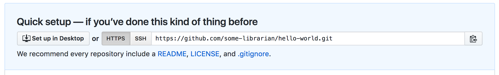
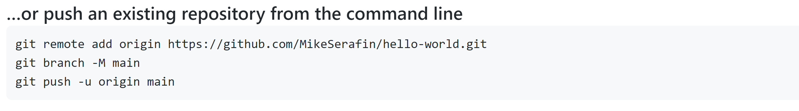

# Library 501 - Introduction to Git

## Workshop description
With this introduction to Git, we will go over the basics on Git and GitHub.  We will go over setting up a GitHub account, explaining basic commands like clone, add, and commit, setting up a repository on GitHub, and how to recover old versions of files.

You will not be an expert by the end of the class. You will probably not even feel very comfortable using Git. This is okay. We want to make a start but, as with any skill, using Git takes practice.

**Note**: This lesson is derived from the [Library Carpentries Introduction to Git](https://librarycarpentry.org/lc-git/) under the Creative Commons ([CC BY 4.0](https://creativecommons.org/licenses/by/4.0/))

## Setup
1. Create a free [GitHub](https://github.com/join) account and confirm your email.
2. Download and install Git for your operating system: [https://git-scm.com/downloads](https://git-scm.com/downloads) (Note: Git for Windows comes bundled with the Git BASH terminal that allows you to use UNIX-style commands on Windows)
3. Configure Git by opening a terminal and entering the following commands:
```bash
$ git config --global user.name "Your Name"
$ git config --global user.email "your@email"
```
This user name and email will be recorded with each commit in the history of your repositories. The email address should be the same one you used when setting up your GitHub account.
You may want to change the default editor to something more familiar by using the `core.editor` config. Any text editor can be made default by adding the correct file path and command line options (see [GitHub help](https://help.github.com/articles/associating-text-editors-with-git/)).  However, the simplest `core.editor` values are `"notepad"` on Windows, `"nano -w"` on Mac, and `"nano -w"` on Linux.  For example:
```bash
$ git config --global core.editor "notepad"
```
You will NOT get an immediate error message if you specify an incorrect or non-existent text editor command here. Therefore, you may first wish to test that the text editor you specify can be invoked, with (for the above example of `"notepad"` on Windows):
```bash
$ touch deleteme.txt
$ notepad deleteme.txt
```
Finally, to check that your configuration changes have been made, use:
```bash
$ git config --list
```

## Getting started with git

### Using Git
One of the main barriers to getting started with git is the language. Although some of the language used in git is fairly self-explanatory, other terms are not so clear. The best way to get to learn the language - which consists of a number of verbs such as `add`, `commit` and `push` (preceded by the word ‘git’) - is by using it, which is what we will be doing during this lesson. These commands will be explained as we proceed from setting up a new version-controlled project to publishing our own website.

### Creating a repository
A Git **repository** is a data structure used to track changes to a set of project files over time. Repositories are stored within the same directory as these project files, in a hidden directory called `.git`. We can create a new git repository either by using GitHub’s web interface, or via the command line. Let’s use the command line to create a git repository for the experiments that we’re going to do today.

First, we will create a new directory for our project and enter that directory.

```bash
$ mkdir hello-world
$ cd hello-world
```
We will now create an empty git reposityro to track changes to our project.  To do this we will use the git **init** command, which is simply short for *initialize*.

```bash
$ git init
```

```console
Initialized empty Git repository in <your file path>/hello-world/.git/
```
The `hello-world` directory is now a git repository.
If we run the `ls` command now (`ls` lists the content of the `hello-world` directory), the repository might seem empty; however adding the `-a` flag for all files via `ls -a` will show all hidden files, which in this case includes the new hidden directory `.git`. Flags can simply be thought of as command options that can be added to shell commands.
Note that whenever we use git via the command line, we need to preface each command (or verb) with `git`, so that the computer knows we are trying to get git to do something, rather than some other program.

### Displaying the current project's status
We can run the `git status` command to display the current state of a project. Let's do that now.

```bash
$ git status
```

```console
On branch master
No commits yet
nothing to commit (create/copy files and use "git add" to track)
```
*Note*: Some versions of Git have named the default branch as "main" and not "master".
The output tells us that we are on the master branch (more on this later) and that we have nothing to commit (no unsaved changes).

### Adding and committing
We will now create and save our firsst project file. This is a two-stage process. First, we **add** any files for which we want to save the changes to a staging area, then we **commit** those changes to the repository. This two-stage process gives us fine-grained control over what should and should not be included in a particular commit.
Let's create a new file using the `touch` command, which is a quick way to create an empty file.

```bash
$ touch index.md
```
The `.md` extension above signifies that we have chosen to use the Markdown format, a lightweight markup language with plain text formatting syntax. We will explore Markdown a bit later.
Let's check the status of our project again.

```bash
$ git status
```

```console
On branch master
No commits yet
Untracked files:
  (use "git add <file>..." to include in what will be committed)

    index.md

nothing added to commit but untracked files present (use "git add" to track)
```
This status is telling us that Git has noticed a new file in our directory that we are not yet tracking. With colourized output, the filename will appear in red. To change this, and to tell Git we want to track any changes we make to `index.md`, we use `git add`.

```bash
$ git add index.md
```
This adds our Markdown file to the **staging area** (the area where Git checks for file changes). To confirm this we want to use `git status` again.

```bash
$ git status
```
```console
On branch master

No commits yet

Changes to be committed:
  (use "git rm --cached <file>..." to unstage)

    new file:   index.md
```
If we are using colourised output, we will see that the filename has changed colour (from red to green). Git also tells us that there is a new file to be committed but, before we do that, let’s add some text to the file.
We will open the file `index.md` with any text editor we have at hand (e.g. Notepad on Windows or TextEdit on Mac OSX) and enter `# Hello, world!`. The hash character is one way of writing a header with Markdown. Now, let’s save the file within the text editor and check if Git has spotted the changes.

```bash
$ git status
```
```console
On branch master

No commits yet

Changes to be committed:
  (use "git rm --cached <file>..." to unstage)

	new file:   index.md

Changes not staged for commit:
  (use "git add <file>..." to update what will be committed)
  (use "git checkout -- <file>..." to discard changes in working directory)

	modified:   index.md
```
This lets us know that git has indeed spotted the changes to our file, but that it hasn't yet staged them, so let's add the new version of the file to the staging area.

```bash
$ git add index.md
```
Now we are ready to *commit* our first changes. Commit is similar to ‘saving’ a file to Git. However, compared to saving, a commit provides a lot more information about the changes we have made, and this information will remain visible to us later.

```bash
$ git commit -m 'Add index.md'
```
```console
[master (root-commit) e9e8fd3] Add index.md
 1 file changed, 1 insertion(+)
 create mode 100644 index.md
```
We can see that one file has changed and that we made one insertion, which was a line with the text '#Hello, world!'. We can also see the commit message 'Add index.md', which we added by using the `-m` flag after `git commit`. The commit message is used to record a short, descriptive, and specific summary of what we did to help us remember later on without having to look at the actual changes. If we just run `git commit` without the `-m` option, Git will launch nano (or whatever other editor we configured as `core.editor`) so that we can write a longer message.

Having made a commit, we now have a permanent record of what was changed, along with metadata about who made the commit and at what time.

### More on the Staging Area
If you think of Git as taking snapshots of changes over the life of a project, `git add` specifies *what* will go in a snapshot (putting things in the staging area), and git commit then actually takes the snapshot, and makes a permanent record of it (as a commit). If you don’t have anything staged when you type `git commit`, Git will prompt you to use `git commit -a` or `git commit --all`, which is kind of like gathering *everyone* for the picture! However, it’s almost always better to explicitly add things to the staging area, because you might commit changes you forgot you made. (Going back to snapshots, you might get the extra with incomplete makeup walking on the stage for the snapshot because you used `-a`!) Try to stage things manually, or you might find yourself searching for "git undo commit" more than you would like!


At the moment, our changes are only recorded locally, on our computer. If we wanted to work collaboratively with someone else they would have no way of seeing what we’ve done. We will fix that in the next episode by using GitHub to share our work.

### Key points for this section
* Git repositories contain metadata about files under version control.
* This metadata enables us to track changes to files over time.
* Git uses a two-stage commit process.  Changes to files must first be added to the stating area, then committed to the repository.

## Sharing your work

### Create a repository on GitHub
When we have logged in to GitHub, we can create a new repository by clicking the **+** icon in the upper-right corner of any page, then selecting **New repository**.  Let's do this now.
* Create a new repository
* Give it the name `hello-world`
GitHub will ask if you want to add a `README.md`, license or a `.gitignore` file. Do not do any of that for now.

#### Choosing a license
Choosing a license is an important part of openly sharing your creative work online. For help in wading through the many types of open source licenses, please visit [https://choosealicense.com/](https://choosealicense.com).

### Connecting your local repository to the GitHub repository

In the previous episode we created a local repository on our own computer. Now we have also created a remote repository on GitHub. But at this point, the two are completely isolated from each other. We want to link them together to synchronize them and share our project with the world.

To do this, we need the GitHub repository URL, which should look something like this (with “some-librarian” replaced with your username):



If the URL starts with `git@` rather than `https://`, please click the “HTTPS” button to change it.

> **HTTPS vs SSH** <br />
> We use HTTPS here because it does not require additional configuration, which vary from operating system to operating system. If you start using Git regularly, you would like to set up SSH access, which is a bit more secure and convenient, by following one of the great tutorials from [GitHub](https://help.github.com/articles/generating-ssh-keys), [Atlassian/BitBucket](https://confluence.atlassian.com/bitbucket/set-up-an-ssh-key-728138079.html) and [GitLab](https://about.gitlab.com/2014/03/04/add-ssh-key-screencast/) (this one has a screencast).

Notice that GitHub is actually helpful enough to provide instructions for us so we don't have to remember these commands:



Again, note that the name of the branch is 'main' on GitHub. Previously, this was called 'master' if you come across that branch in other tutorials.

In the above image, instead of 'MikeSerafin', you will see your own username.

You can therefor choose to copy these and paste them on the command line. Or you can choose to type them out to get them into your fingers. I will do that. So we start with the command to link our local repository to the GitHub repository:

```bash
$ git remote add origin https://github.com/MikeSerafin/hello-world.git
$ git branch -M main
$ git push -u origin main
```
where `MikeSerafin` should be replaced with your own username.

> **Why origin?** <br />
> `origin` in the `git remote add` line is just a short name or alias we’re giving to that big long repository URL. It could be almost any string we want, but by convention in git, it is usually called `origin`, representing where the repo originated.

We can check that it is set up correctly with the command:
```bash
$ git remote -v
```
```console
origin  https://github.com/<your_github_username>/hello-world (fetch)
origin  https://github.com/<your_github_username>/hello-world (push)
```

### Pushing changes

Now we have established a connection between the two repositories and we have synchronized the content when we ran `git push -u origin main` above.

The nickname of our remote repository is "origin" and the default local branch name is "main" (or "master"). The -u flag tells git to remember the parameters, so that next time we can simply run `git push` and Git will know what to do.

Pushing our local changes to the Github repository is sometimes referred to as "pushing changes `upstream` to Github". The word `upstream` here comes from the git flag we used earlier in the command `git push -u origin master`. The flag `-u` refers to `-set-upstream`, so when we say pushing changes upstream, it refers to the remote repository.

You may be prompted to enter your GitHub username and password to complete the command.

When we do a `git push`, we will see Git 'pushing' changes upstream to GitHub. Because our file is very small, this won’t take long but if we had made a lot of changes or were adding a very large repository, we might have to wait a little longer. We can check where we’re at with `git status`.

```bash
$ git status
```
```console
On branch main
Your branch is up-to-date with 'origin/main'.
nothing to commit, working tree clean
```

This output lets us know where we are working (the main branch). We can also see that we have no changes to commit and everything is in order.

We can use the `git diff` command to see changes we have made before making a commit. Open `index.md` with any text editor and enter some text on a new line, for instance "A new line" or something else. We will then use `git diff` to see the changes we made:

```bash
$ git diff
```
```console
diff --git a/index.md b/index.md
index aed0629..989787e 100644
--- a/index.md
+++ b/index.md
@@ -1 +1,2 @@
-# Hello, world!
\ No newline at end of file
+# Hello, world!
+A new line
```

The command produces lots of information and it can be a bit overwhelming at first, but let’s go through some key information here:

1. The first line tells us that Git is producing output similar to the Unix `diff` command, comparing the old and new versions of the file.
2. The second line tells exactly which versions of the file Git is comparing; `aed0629` and `989787e` are unique computer-generated identifiers for those versions.
3. The third and fourth lines once again show the name of the file being changed.
4. The remaining lines are the most interesting; they show us the actual differences and the lines on which they occur. In particular, the + markers in the first column show where we have added lines.

We can now commit these changes:
```bash
$ git add index.md
$ git commit -m "Add another line"
```

If we are very forgetful and have already forgotten what we changes we have made, `git log` allows us to look at what we have been doing with our git repository (in reverse chronological order, with the very latest changes first).
```bash
$ git log
```
```console
commit 8e2eb9920eaa0bf18a4adfa12474ad58b765fd06
Author: Your Name <your_email>
Date:   Mon Jun 5 12:41:45 2017 +0100

    Add another line

commit e9e8fd3f12b64fc3cbe8533e321ef2cdb1f4ed39
Author: Your Name <your_email>
Date:   Fri Jun 2 18:15:43 2017 +0100

    Add index.md
```
This shows us the two commits we have made and shows the messages we wrote. It is important to try to use meaningful commit messages when we make changes. This is especially important when we are working with other people who might not be able to guess as easily what our short cryptic messages might mean. Note that it is best practice to always write commit messages in the imperative (e.g. ‘Add index.md’, rather than ‘Adding index.md’).

### Pushing changes (again)
Now, let’s have a look at the repository at GitHub again (that is, `https://github.com/some-librarian/hello-world` with `some-librarian` replaced with your username). We see that the `index.md` file is there, but there is only one commit:


And if you click on `index.md` you will see that it contains the “Hello, world!” header, but not the new line we just added.

This is because we haven’t yet pushed our local changes to the remote repository. This might seem like a mistake in design but it is often useful to make a lot of commits for small changes so you are able to make careful revisions later and you don’t necessarily want to push all these changes one by one.

Another benefit of this design is that you can make commits without being connected to internet.

But let’s push our changes now, using the `git push` command:

```bash
$ git push
```
```console
Counting objects: 3, done.
Writing objects: 100% (3/3), 272 bytes | 0 bytes/s, done.
Total 3 (delta 0), reused 0 (delta 0)
To https://github.com/<your_github_username>/hello-world
   e9e8fd3..8e2eb99  main -> main
```
And let's check on GitHub that we now have 2 commits there.


